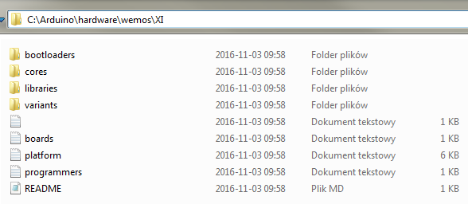
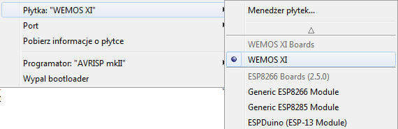

#Wemos XI board drivers for Arduino IDE  

[Wemos XI github](https://github.com/wemos/Arduino_XI)  

EN:  

Installation:
* Unpack an archive,
* in Arduino IDE install catalog, open "hardware" catalog,
* create a "wemos" catalog, then enter to it,
* inside a "wemos catalog, create a "XI" catalog,
* now paste files from archive.

It should look like this: "C:\Arduino\hardware\wemos\XI", in this catalog all files and catalogs should be put. Eg. bootloaders, cores, libraries etc.
  
After Arduino IDE restart, change board to Wemos XI.  

PL:

Instalacja:  
* Rozpakuj archiwum,
* W folderze gdzie zainstalowane jest Arduino IDE otwórz folder "hardware",
* Utwórz katalog "wemos", następnie w nim utworz kolejny katalog "XI",
* Zawartość archiwum przenieœ do folderu XI.

Ścieżka powinna wyglądać mniej więcej tak: "C:\Arduino\hardware\wemos\XI" a w środku powinny być wszystkie foldery i pliki.  
    
Po zresetowaniu Arduino IDE, nale¿y wybraæ płytkę Wemos XI.   
   
 
